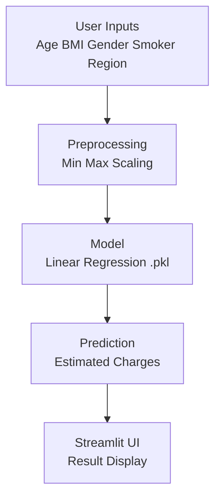

# 🏥 Insurance Charges Predictor  
### A Machine Learning Web App for Predicting Health Insurance Costs 
<br/>
**By: DrVaishnaviKR**
<br/>
AI Enthusiast | Healthcare + Data Science | Streamlit Developer
<br/>
Connect on LinkedIn --https://www.linkedin.com/in/dr-vaishnavi-k-r-577947314/

🚀 **Live Demo:**  👉 https://insurance-charges-predictor1-1.streamlit.app/

This project is an end-to-end implementation of a **Health Insurance Charge Prediction System** built using **Linear Regression** and deployed as an interactive **Streamlit Web App**.  
It allows users to input basic health & demographic information and instantly get a predicted insurance cost.

---
<p align="center">

<!-- Project Status -->


<!-- Streamlit -->


<!-- Python -->


<!-- Machine Learning -->


<!-- scikit-learn -->


<!-- Dataset -->


<!-- App Link -->
<a href="https://insurance-charges-predictor1-1.streamlit.app/">

</a>

<!-- License -->


</p>

<br>

<h2 style="font-size:30px">1. Overview</h2>

This project estimates individual health insurance charges using demographic and lifestyle attributes.  
It showcases a complete ML workflow including preprocessing, scaling and deployment in a user friendly Streamlit application.

This project suits healthcare analytics learners and beginners exploring ML deployment.

<br>

<h2 style="font-size:30px">2. Features</h2>

• Interactive modern UI  
• Real time predictions  
• Built in min max scaling  
• Lightweight linear regression model  
• One click Streamlit Cloud deployment  
• Easy to extend and modify  

<br>

<h2 style="font-size:30px">3. Workflow Diagram</h2>


<br> <h2 style="font-size:30px">4. Input Features</h2>

| Feature  | Type     | Details               |
| -------- | -------- | --------------------- |
| Age      | Numeric  | Person’s age in years |
| BMI      | Numeric  | Body Mass Index       |
| Gender   | Category | Male or Female        |
| Smoker   | Category | Yes or No             |
| Region   | Category | NE NW SE SW           |
| Children | Numeric  | Number of dependents  |

<br> <h2 style="font-size:30px">5. Project Structure</h2>

```
Insurance_Charges_Prediction/
│── app.py
│── linear_regression_model.pkl
│── min_max_values.json
│── requirements.txt
│── README.md
```
<br> <h2 style="font-size:30px">6. Usage</h2>

Enter user details in the interface
Tap “Predict”
View predicted insurance charges instantly

<br> <h2 style="font-size:30px">7. Example Predictions</h2>
| Age | BMI  | Smoker | Predicted Charges |
| --- | ---- | ------ | ----------------- |
| 30  | 24.3 | No     | ₹8400             |
| 45  | 29.7 | Yes    | ₹23700            |
| 52  | 31.1 | No     | ₹16400            |

<br> <h2 style="font-size:30px">8. Deployment</h2>

Deployed on Streamlit Cloud.
Any push to the main branch automatically updates the live application.

<br> <h2 style="font-size:30px">9. Contributing</h2>

Fork the repository, create a new branch and submit a pull request for improvements or new features.
## 10.Project Highlights

- 🧠 **Machine Learning Model:** Linear Regression  
- 📊 **Dataset:** Health Insurance dataset (`Health_insurance (1).csv`)  
- 🔍 **Feature Scaling:** Min–Max scaling using stored JSON values  
- 🌐 **Deployment:** Streamlit Cloud  
- 🛠 **Tech Stack:** Python, scikit-learn, pandas, NumPy, Streamlit  
- ⚙ **Artifacts included:** Trained model (`linear_regression_model.pkl`), scaler values, dataset, requirements.txt

---

👉 Try it yourself using the live Streamlit URL!
## 11. Installation
Install locally with Python

Step 1: Clone the repository
git clone https://github.com/DrVaishnaviKR/Insurance-charge-prediction

Step 2: Navigate into the project folder
cd Insurance_Charges_Prediction

Step 3: Install all required dependencies
pip install -r requirements.txt

Step 4: Launch the Streamlit application
streamlit run app.py


---


